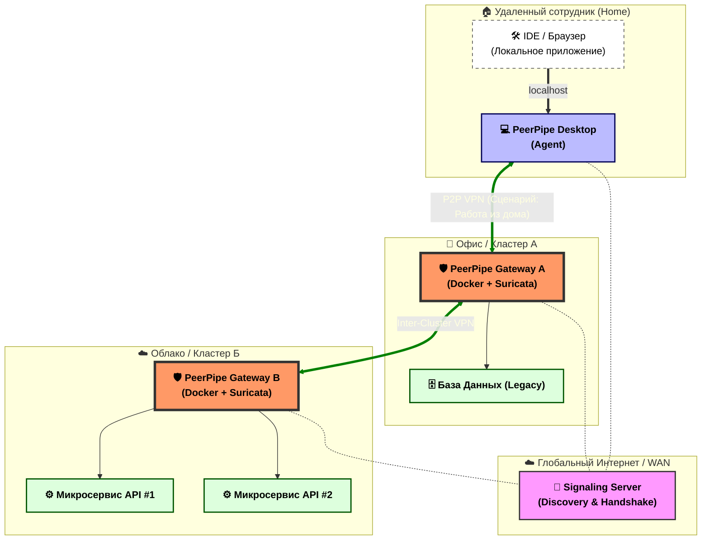
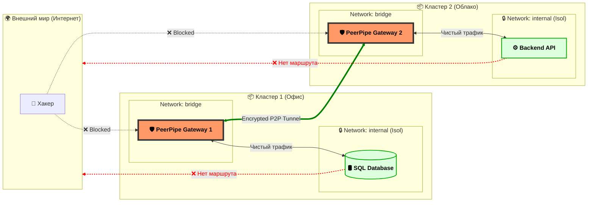
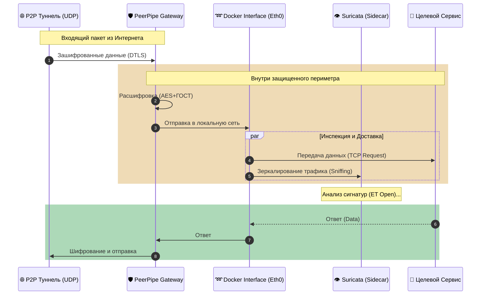
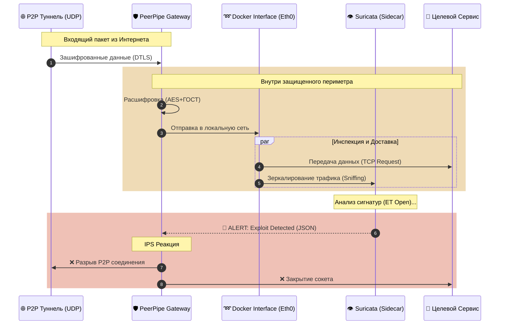
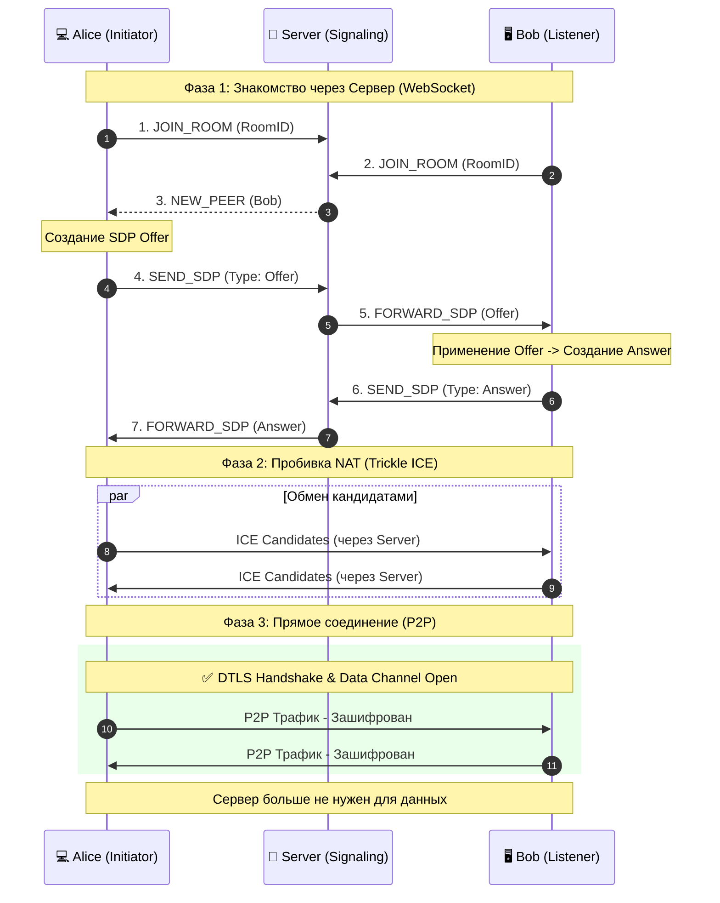
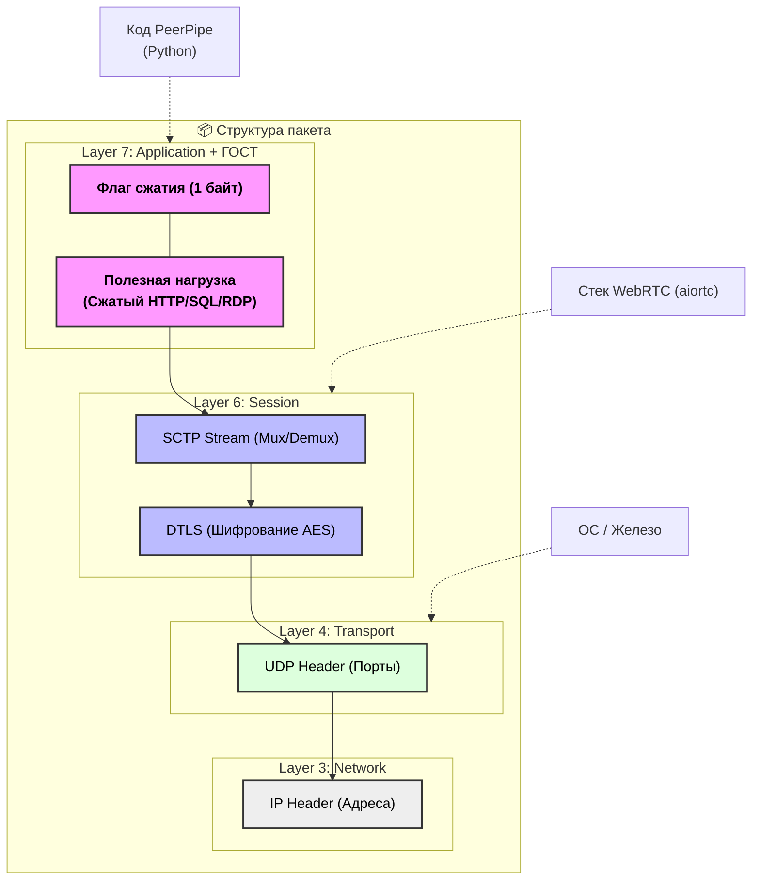

# Проект PeerPipe

Приложения:
- Сервер
- Клиент *(docker)* + Suricata
- Клиент Desktop

## Схема 1. Сценарий использования

---

## Схема 2. Изоляция сетей

---
## Схема 3.1 Процесс обработки соединения PeerPipe Gateway, чистое соединение

---
## Схема 3.2 Процесс обработки соединения PeerPipe Gateway, опасное соединение

---
## Схема 4. Установление P2P-соединения

---
## Схема 5. Инкапсуляция данных

